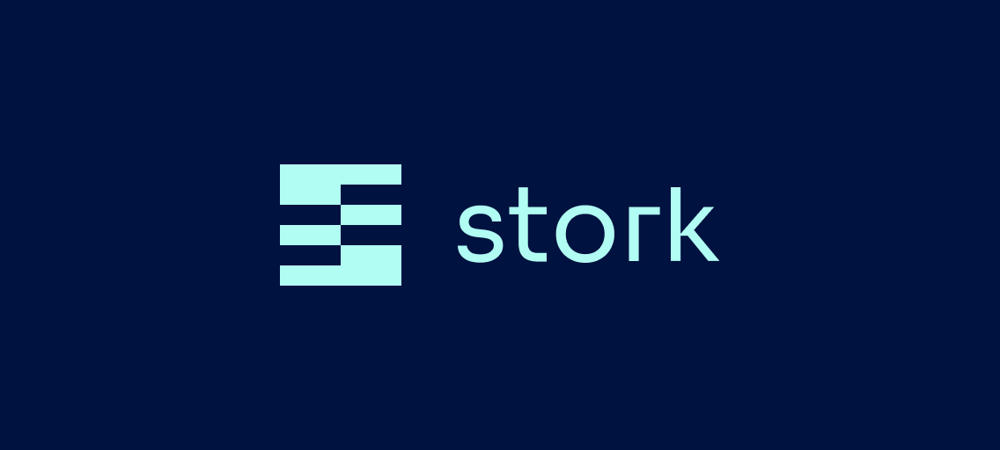

<b>Your Data, Your Protocol</b>

## Stork External

Stork leverages cryptographic primitives used in blockchain technologies to securely and reliably deliver accurate, ultra low latency, and chain ambivalent data feeds.

This repository contains various components utilized by data publishers and subscribers to leverage Stork's technology.

#### CLI

Tooling used to interface with Stork's services and on-chain contracts.

#### Contracts

All contracts developed by Stork will be managed in this repository.
